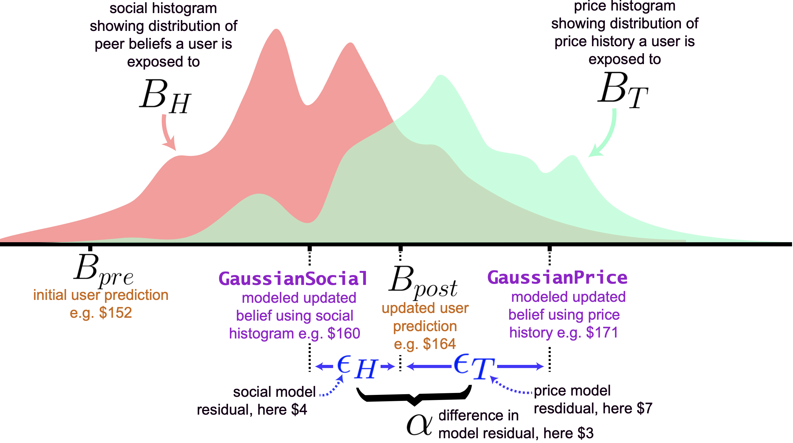

# Accuracy-Risk Trade-off due to Social Learning in Crowd-sourced Financial Predictions

## Directories:

- `raw data`: this directory contains most of the raw data we collected from participants, i.e. the predictions made by people during prediction rounds

## Files:

- `utilities.py`:
  - this file contains various python function utilities for general usage. e.g. this contains a function that downloads futures asset price from barchart (you'll need to reqest an API from them), and then combines this data with various other data.
- `generate belief update model data.py`: 
  - file reads the raw data and generate the residual of the belief update models and save it to 'learning_dic_all.csv'
- `conjugate vs empirical.py`: 
  - file reads learning_dic_all.csv plots the performance of different belief update models. the plotting pipeline is as such: files are read in python (full python conda environment is detailed before), processed using pandas, etc. and then plotted using r's ggplot2 via rpy2. this creates fig. 2 in paper. 
- `bar chart improvement error bar.py`: 
  - file plots fig 3.
- `momentum.py`: 
  - file pulls asset and futures data from barchart.com's API and calculates first-order momentum predictions that are used in Table 1 in the paper.
- `brexit plot.py`: 
  - file plots Brexit candlestick plot in supplementary fig. S1.
- `plotting improvement vs alpha BREXIT.py`: 
  - file subsets predictions by alpha and then plots fig. 5.
- `generating_improvement_data.py`: 
  - file reads predictions from `raw data/` directory, subsets predictions by alpha and then saves improvement data to csv
- `generating_risk_data.py`: 
  - file generates risk subsets data for paretto curve improvements 
- `paretto curve.py`: 
  - file reads paretto data and plots paretto curve in fig. 4.
- `python_environment.yml`: 
  - conda environment python packages and versions generated using https://docs.conda.io/projects/conda/en/latest/user-guide/tasks/manage-environments.html#exporting-an-environment-file-across-platform